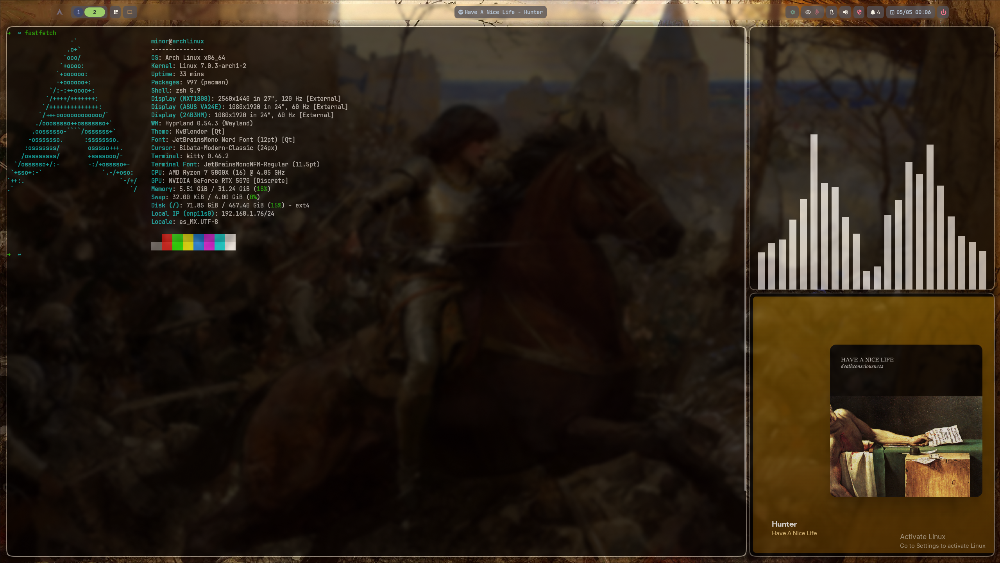

# HyprFlow-Arch

Complete **Hyprland + Arch Linux** configuration optimized for technical productivity on desktop, with multi-monitor support, Logitech/Apple peripherals, and automated dynamic theming.

## Compatibility

> **Note:** As of Hyprland 0.55, `.conf` (hyprlang) is deprecated in favor of Lua. This repo targets the Lua format. The last `.conf`-based checkpoint is tagged `pre-lua-migration`.

| Tool | Version |
|------|---------|
| Hyprland | 0.55+ |
| Waybar | 0.15.0 |
| eww | 0.6.0 |
| swaync | 0.12.6 |
| wallust | 3.5.2 |
| rofi-wayland | 2.0.0 |

## Key Features

- **Automated install** — one script copies configs, creates symlinks, and applies the base theme
- **Dynamic theming** — color palettes auto-generated with `wallust` on wallpaper change, synced to cava visualizer
- **Master layout** — main window takes priority, secondary windows stack on the side
- **3-monitor management** — automatic logical mapping via `monitors.sh`, configurable layout (4 with ThinkPad)
- **Peripheral battery in Waybar** — mouse, keyboard, trackpad, and headset in real time
- **Status modules** — VPN, camera, microphone, audio, and DND notifications integrated

## Table of Contents

- [Preview](#preview)
- [Hardware & Peripherals](#hardware--peripherals)
- [Installation](#installation)
- [Monitor Setup](#monitor-setup)
- [Included Scripts](#included-scripts)
- [Post-Installation](#post-installation)
- [Hyprland Plugins](#hyprland-plugins)
- [Tips](#tips)

## Preview




## Hardware & Peripherals

Setup designed for the following peripherals, with integrated battery monitoring:

| Peripheral | Model |
|------------|-------|
| Mouse | Logitech MX Master 3S |
| Keyboard | Logitech MX Keys S |
| Trackpad | Apple Magic Trackpad |

### Monitor Layout

Monitors are managed by the `monitors.sh` wizard (see [Monitor Setup](#monitor-setup)).
A typical desktop layout left to right:

| Position | Monitor | Resolution |
|----------|---------|------------|
| 1 | AOC | 1080p |
| 2 | NZXT (Primary) | 1440p @ 120Hz |
| 3 | ASUS | 1080p |

> When connecting the ThinkPad it joins as a 4th monitor (`eDP-1`).

## Installation

### 1. Install dependencies

**Official repositories:**
```bash
sudo pacman -S cpio cmake fzf rtkit hyprland waybar yazi kitty awww brightnessctl playerctl pipewire wireplumber pipewire-pulse pavucontrol network-manager-applet upower openconnect jq pacman-contrib swaync hyprshot hyprpicker rofi-wayland ttf-jetbrains-mono-nerd noto-fonts-cjk wl-clipboard satty gnu-free-fonts gnome-themes-extra xdg-desktop-portal xdg-desktop-portal-gtk xdg-desktop-portal-hyprland gnome-disk-utility polkit-gnome cava
```

**AUR (requires `yay` or another helper):**
```bash
yay -S wlogout eww-git waypaper-git wallust headsetcontrol bibata-cursor-theme-bin paru fzf-tab oh-my-zsh-git
```

### 2. Clone and install

This repo uses **Git submodules** (Rofi themes, trackpad-battery, sinkswitch). Clone with `--recursive`:

```bash
git clone --recursive https://github.com/AlejandroMinor/HyprFlow-Arch.git
cd HyprFlow-Arch
bash install.sh
```

Available flags:

```bash
bash install.sh --skip-theme      # keep your current theme/colors
bash install.sh --skip-monitors   # don't launch the monitor wizard; just apply
                                   # the saved profile / default non-interactively
```

By default the install runs the monitor wizard (`monitors.sh setup`). Use
`--skip-monitors` for an unattended install — monitors are still configured via the
saved profile or a sensible default, just without prompting.

If you already cloned without `--recursive`:
```bash
git submodule update --init --recursive
```

The install script handles:
- Setting execute permissions on all `.sh` and `.py` scripts
- Copying configuration to `~/.config`
- Creating symlinks for binaries in `~/.local/bin`
- Applying the default color palette
- Reloading Hyprland and plugins

### 3. First steps

Run `help-binds.sh` or press `Super + I` to see all available keybindings:

```bash
help-binds.sh
```

## Monitor Setup

Monitors are managed by `monitors.sh`, an interactive wizard that identifies each
monitor by its **description** (e.g. `NZXTCANVAS27Q...`) instead of the connector name
(`DP-2`), which changes between reboots and machines. It saves a **profile per set of
connected monitors** and regenerates the config for **both Hyprland and Waybar** from it.

### Commands

| Command | What it does |
|---------|--------------|
| `monitors.sh list` | Read-only. Prints each connected monitor's description, port and current mode. |
| `monitors.sh setup` | Interactive wizard. Per monitor: enable, rotation, scale, Waybar bar type; then order (left → right) and which is primary. Saves the profile and applies it. |
| `monitors.sh apply` | Non-interactive. Loads the profile matching the current set (or a sane default) and regenerates everything. Used on login and hotplug. |

### What it generates

These live in `~/.config` (generated at runtime, not tracked in the repo):

| File | Purpose |
|------|---------|
| `hypr/monitors_active.lua` | `hl.monitor` + workspace rules. Positions computed left → right with no gaps. Required from `hyprland.lua`. |
| `waybar/config` | One bar per monitor. The `output` is matched by the monitor **identifier** (`make model serial`), not the connector name. |
| `hypr/monitor-profiles.json` | Saved profiles, keyed by the sorted set of monitor descriptions. |

### How it stays in sync (dynamic)

There is **no background daemon**. `monitors.sh apply` runs:

1. **On login** — launched from the `hyprland.lua` startup block.
2. **On hotplug** — `hl.on("monitor.added" / "monitor.removed")` in `hyprland.lua` calls it when you connect/disconnect a monitor.
3. **Manually** — whenever you run `setup` / `apply`.

`apply` only reloads Hyprland / restarts Waybar if the generated output actually changed, which avoids reload loops.

### Rotation

The wizard asks for a **transform (0-7)** — the native Hyprland values:

| transform | rotation |
|-----------|----------|
| 0 | normal |
| 1 / 3 | 90° / 270° (portrait) |
| 2 | 180° (upside down) |
| 4-7 | the same, mirrored |

Portrait transforms (odd numbers) swap width/height automatically for positioning and bar width.

### Editing Waybar

Three layers — edit the right file:

| To change… | Edit |
|------------|------|
| A module's behaviour / appearance | `waybar/modules.json` |
| Which modules go in each bar (plus margins / layer) | `waybar/bars.json` (the `full` / `minimal` archetypes) |
| Which monitor a bar lands on | nothing — `monitors.sh` handles it |

Adding a module = define it in `modules.json` **and** place it in `bars.json`, then run
`monitors.sh apply`. The script does not hardcode bar contents.

> `dotconfig/waybar/config` is only a **fallback** (a single bar shown on every monitor),
> used if `monitors.sh` never runs. The real, per-monitor config is generated.

### Install behaviour

By default `install.sh` runs `monitors.sh setup` (the wizard). Use
`install.sh --skip-monitors` for an unattended install — monitors are still configured
from the saved profile / default, just without prompting.

## Included Scripts

All scripts in `bin/` are available globally in `~/.local/bin` after installation.

**Theming**

| Script | Description |
|--------|-------------|
| `wallust-theme-manager.sh` | Generates dynamic color palettes and applies themes |
| `theme-picker.sh` | Interactive theme selector with pre-designed color palettes |

**Monitors & Layout**

| Script | Description |
|--------|-------------|
| `monitors.sh` | Interactive monitor wizard: `list` / `setup` / `apply`. Detects monitors by description and generates `monitors_active.lua` + Waybar config |
| `session-manager/` | Suite for saving and restoring window layouts (save, load, restore, snapshot) |

**Waybar Status Modules**

| Script | Description |
|--------|-------------|
| `mute_indicator.sh` | Microphone status indicator |
| `vpn_status.sh` | VPN connection status |
| `peripherals_battery.sh` | Peripheral battery levels (mouse, keyboard) |
| `g733_battery.sh` | Logitech G733 headset battery |
| `trackpad-battery` | Apple Magic Trackpad battery |
| `camera_status.py` | Camera-in-use indicator |
| `swaync-dnd.sh` | Do Not Disturb control for SwayNC |
| `battery_alert.py` | Low system battery alert |
| `cava-waybar.sh` | Cava audio visualizer output for Waybar (hides when silent) |

**Utilities**

| Script | Description |
|--------|-------------|
| `help-binds.sh` | Shows all keybindings in a visual interface |
| `hyprland-group-all.sh` | Groups all windows in the current workspace |
| `sinkswitch` | Quick audio output switcher |

**Included submodules:**
- `modules/rofi-collection` — collection of Rofi themes, applets, and launchers
- `modules/apple-magic-trackpad-battery` — trackpad battery script
- `modules/sinkswitch` — audio output switching utility

## Post-Installation

### Zsh + Oh My Zsh (optional)

A separate script is included if you want to use the same Zsh setup. It backs up your existing `.zshrc` before overwriting.

**Dependencies:**
```bash
# Official repos
sudo pacman -S zsh zsh-autosuggestions zsh-syntax-highlighting zoxide bat

# AUR
yay -S fzf-tab oh-my-zsh-git
```

**Install:**
```bash
bash install-zsh.sh
```

Plugins included:

| Plugin | Source | Description |
|--------|--------|-------------|
| `git` `sudo` `copypath` `fzf` | Oh My Zsh built-in | Git aliases, sudo escape, clipboard, fzf integration |
| `zsh-autosuggestions` | Official repos | Command suggestions from history |
| `zsh-syntax-highlighting` | Official repos | Real-time command highlighting |
| `fzf-tab` | AUR (`fzf-tab`) | Tab completion with fzf preview using `bat` |
| `zoxide` | Official repos | Smart `cd` replacement (`z`, `zi`) |

### Dark theme
To force dark colors for GTK apps:

```bash
gsettings set org.gnome.desktop.interface color-scheme 'prefer-dark'
gsettings set org.gnome.desktop.interface gtk-theme 'Adwaita-dark'
gsettings set org.gnome.desktop.interface icon-theme 'Adwaita'
```

### Magic Trackpad (optional)

For the trackpad battery module to work correctly, see the full setup guide (permissions, groups, and security options) in the submodule README:

[apple-magic-trackpad-battery/README.md](https://github.com/AlejandroMinor/apple-magic-trackpad-battery-percent-python/blob/main/README.md)

### Theming with Waypaper (recommended)

In `~/.config/waypaper/config.ini`, enable `zen_mode` and set the `post_command` to regenerate the palette on wallpaper change:

```ini
[Settings]
backend = awww
fill = fill
zen_mode = True
post_command = bash -c "$HOME/HyprFlow-Arch/bin/wallust-theme-manager.sh --generate-palette --notify"
```

To restore or change the color palette, use the interactive theme picker:

```bash
theme-picker.sh
```

Or manually restore the default theme:

```bash
wallust cs ~/HyprFlow-Arch/wallust/themes/minor-default.json
~/HyprFlow-Arch/bin/wallust-theme-manager.sh --restore-default --notify
```

### Cava audio visualizer

Cava is integrated in two ways: as a terminal visualizer and as a Waybar center module. Colors sync automatically with the active wallust theme — the palette is regenerated each time wallust runs and saved to `~/.config/cava/themes/wallust`.

**Terminal:**
```bash
cava
```

**Waybar:** the `custom/cava` module runs `cava-waybar.sh`, which displays block-character bars in the center of the bar next to the media info. It hides automatically when there is no audio.

Static themes `solarized_dark` and `tricolor` are available in `~/.config/cava/themes/` as fallbacks.

## Hyprland Plugins

Install and manage plugins with `hyprpm`:

```bash
hyprpm update
hyprpm add https://github.com/hyprwm/hyprland-plugins
hyprpm enable <plugin-name>
```

Currently active plugins:

| Plugin | Description |
|--------|-------------|
| `hyprfocus` | Enhanced window focus animation |
| `hyprwinwrap` | Embed apps directly as desktop background |
| `hymission` | macOS-style Mission Control window overview, install via `hyprpm add https://github.com/gfhdhytghd/hymission` |

> **Note:** If errors about animations or invalid references appear on startup, the plugins are likely outdated relative to the installed Hyprland version. Run:
>
> ```bash
> hyprpm update
> ```

## Tips

- **Waybar + monitors:** If a bar lands on the wrong monitor or doesn't appear, run `monitors.sh list` to see each monitor's exact identifier, then `monitors.sh setup` to rebuild the layout. Waybar matches the monitor **identifier** (`make model serial`), not the connector name.
- **Monitor mapping:** If you add or change monitors, run `monitors.sh setup` (or `monitors.sh apply` to reuse a saved profile). It also re-applies automatically on login and on monitor hotplug.
- **Sessions:** `session-manager/save.sh` saves the current layout; `restore.sh` restores it. Both are available as keybindings.
- **DisplayLink:** Install `displaylink` and `evdi-dkms-git` from AUR (`yay -S displaylink evdi-dkms-git`), then enable the service with `sudo systemctl enable --now displaylink.service`.
- **Permissions:** If a script won't run, `chmod +x script_name`. `install.sh` sets them automatically.
