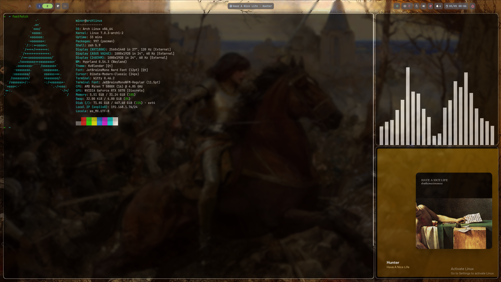

# HyprFlow-Arch

Hyprland + Arch Linux desktop config: multi-monitor, dynamic theming from the
wallpaper, and Waybar modules for peripheral batteries and system status.




## Quick start

```bash
git clone --recursive https://github.com/AlejandroMinor/HyprFlow-Arch.git
cd HyprFlow-Arch
bash install.sh
```

That is the whole install. The script checks your packages, submodules and
Hyprland plugins first, then copies the configs, links the scripts, installs the
fonts and walks you through your monitors. Anything still missing is printed
again at the end with the exact command to fix it, so nothing scrolls past.

Add `--with-deps --with-plugins` and it installs those for you too.

Then press `Super + I` for the keybindings.

### Running it again

It is also the sync tool: name a step and only that step runs. `install.sh config`
is the one you will use most, to push a dotfile change into `~/.config` without
the checks or the monitor wizard.

```bash
install.sh                  # everything
install.sh config           # dotfiles, scripts and fonts, then reload
install.sh check            # just tell me what is missing
install.sh theme            # just recolour
install.sh monitors         # just the monitor wizard
install.sh lockscreen       # just rebuild the lockscreen layout
install.sh zsh              # just install .zshrc
install.sh config theme     # steps combine
```

| Option | Effect |
|--------|--------|
| `--with-deps` | Install the missing packages (pacman, then yay or paru) |
| `--with-plugins` | Install the missing Hyprland plugins (compiles, slow) |
| `--with-zsh` | Include the zsh step in a full run |
| `--help` | The list above |

Cloned without `--recursive`? `install.sh` fetches the submodules itself.

## Requirements

Arch, with Hyprland already running. `install.sh` tells you what you are missing,
so you can run it first and let it decide.

| Tool | Version |
|------|---------|
| Hyprland | 0.56+ |
| Waybar | 0.15.0 |
| eww | 0.6.0 |
| swaync | 0.12.6 |
| wallust | 3.5.2 |
| rofi | 2.0.0 |

<details>
<summary>Full package list</summary>

```bash
sudo pacman -S hyprland hyprlock hyprshot hyprpicker waybar rofi swaync wlogout cava awww kitty yazi satty btop fastfetch gnome-disk-utility pipewire pipewire-pulse wireplumber pavucontrol rtkit brightnessctl playerctl upower openconnect network-manager-applet gtk4 gtk4-layer-shell gnome-themes-extra polkit-gnome libnotify xdg-desktop-portal xdg-desktop-portal-gtk xdg-desktop-portal-hyprland ttf-jetbrains-mono-nerd noto-fonts-cjk gnu-free-fonts python python-gobject jq curl imagemagick wl-clipboard fzf cpio cmake pacman-contrib
```

```bash
yay -S eww-git waypaper-git wallust headsetcontrol bibata-cursor-theme-bin
```

These live in the `PACMAN_PKGS` and `AUR_PKGS` arrays at the top of `install.sh`.

</details>

> Hyprland configs here use the Lua format (`.conf`/hyprlang is deprecated since 0.55).
> The last `.conf` checkpoint is tagged `pre-lua-migration`.

Built around a Logitech MX Master 3S, MX Keys S, and an Apple Magic Trackpad.
That is what the battery modules read. Everything else works without them.

# Customizing

Everything below is optional. Pick the piece you want to change.

| I want to change… | Go to |
|-------------------|-------|
| Which monitor gets which bar, rotation, scale | [Monitors](#monitors) |
| What is in the bar, and how it looks | [Waybar](#waybar) |
| Colors, wallpaper, presets | [Theming](#theming) |
| The lockscreen layout and avatar | [Lockscreen](#lockscreen) |
| The launcher and power menu | [Rofi](#rofi) |
| Hyprland plugins | [Plugins](#plugins) |
| What a given script does | [Scripts](#scripts) |

## Monitors

`monitors.sh` identifies monitors by **description** (`NZXTCANVAS27Q...`) instead of
connector name (`DP-2`), which changes between reboots. It saves one profile per set
of connected monitors and regenerates both the Hyprland and Waybar config from it.

| Command | What it does |
|---------|--------------|
| `monitors.sh list` | Print each monitor's description, port, and mode |
| `monitors.sh setup` | Wizard: enable, rotation, scale, bar type, order, primary |
| `monitors.sh apply` | Non-interactive: load the matching profile and regenerate |

It generates these in `~/.config` (not tracked in the repo):

- `hypr/monitors_active.lua`: `hl.monitor` + workspace rules, positioned left → right
- `waybar/config`: one bar per monitor, matched by identifier (`make model serial`)
- `hypr/monitor-profiles.json`: saved profiles

No daemon. `apply` runs on login and on hotplug (via `hl.on("monitor.added")` in
`hyprland.lua`), and only reloads if the output actually changed.

Rotation uses native Hyprland transforms (`0` normal, `1`/`3` portrait, `2` upside
down, `4-7` mirrored). Portrait swaps width/height automatically.

## Waybar

Three layers. Edit the right one:

| To change… | Edit |
|------------|------|
| A module's behaviour | `waybar/modules.json` |
| Which modules go in a bar | `waybar/bars.json` (`full` / `minimal` archetypes) |
| Which monitor a bar lands on | nothing, `monitors.sh` handles it |

Adding a module means defining it in `modules.json`, placing it in `bars.json`, then
running `monitors.sh apply`. `dotconfig/waybar/config` is only a fallback for when
`monitors.sh` has never run.

**Styles.** Four variants: `style-minor`, `style-island`, `style-glass`,
`style-clusters`. Switch by changing the single `@import` in `style.css`.

**Runner.** `custom/hardware-wrap` is an animated runner that speeds up with CPU load
and opens the hardware drawer. Two fonts ship in the repo (cat and chicken, sharing
codepoints `U+E900`-`U+E904`). Run `pet-picker.sh` to switch, or edit
`runcat-runner.css`, the one file all four styles import. Tunables (icons, CPU
thresholds, FPS) live in `runcat-config.json`.

## Theming

Colors come from `wallust`, regenerated on wallpaper change and pushed to Waybar,
Hyprland, kitty, rofi, wlogout, hyprlock, and cava.

Wire it up in `~/.config/waypaper/config.ini`:

```ini
[Settings]
backend = awww
fill = fill
zen_mode = True
post_command = bash -c "$HOME/HyprFlow-Arch/bin/wallust-theme-manager.sh --generate-palette --notify"
```

Run `theme-picker.sh` to pick between the wallpaper palette and nine presets
(Tokyo Night, Catppuccin, Nord, Gruvbox, Dracula, Monochrome, Synthwave, Kanagawa,
Minor Default).

Cava runs both in the terminal and as the `custom/cava` Waybar module, which hides
itself when there's no audio. Its palette follows wallust too.

## Lockscreen

`hyprlock`, bound to `Super + L` and the wlogout Lock button: oversized clock, glass
bar with avatar and password field, now-playing card. Track details show only for
dedicated music apps, since a lockscreen is visible to passers-by. Media keys keep working
under the lock.

`hyprlock.conf` holds no coordinates. `dotconfig/hypr/hyprlock/geometry.sh` runs before
each lock and writes them, so the layout follows whatever monitor is attached. Edit
that script, never the generated `hyprlock-geometry.conf`.

Content lands on the monitor holding workspace 1; the rest are blurred. Override with
`HYPRLOCK_MONITOR`. The avatar is `~/.config/hypr/avatar.png`. Replace it with any
square image and it's never overwritten, or delete it for the Arch glyph instead.

## Rofi

`dotconfig/rofi/hyprflow/`: real transparency, wallust colors. Two variants share
`launcher-base.rasi`: `launcher-centered.rasi` (`Super + Space` / `Super + D`) and
`launcher.rasi` (the Waybar launcher icon). Power menu is `wlogout`, also themed.

## Plugins

| Plugin | Repo | Description |
|--------|------|-------------|
| `hyprfocus` | `hyprwm/hyprland-plugins` | Window focus animation |
| `hymission` | `gfhdhytghd/hymission` | Mission Control-style overview |
| `hyprglass` | `hyprnux/hyprglass` | Liquid glass on transparent windows |

`install.sh` reports which of these are missing or disabled. It does not install
them unless you pass `--with-plugins`, because `hyprpm` compiles each one against
your running Hyprland, which is slow and can fail. By hand:

```bash
hyprpm update
hyprpm add https://github.com/gfhdhytghd/hymission
hyprpm enable hymission
```

Add a plugin to `PLUGIN_NAMES` and `PLUGIN_REPOS` at the top of `install.sh` and the
check picks it up.

> Animation or invalid-reference errors on startup usually mean the plugins are stale
> relative to your Hyprland version. Run `hyprpm update`.

## Scripts

Everything in `bin/` lands in `~/.local/bin`.

**Theming & layout**

| Script | Description |
|--------|-------------|
| `wallust-theme-manager.sh` | Generate and apply color palettes |
| `theme-picker.sh` | Interactive theme selector |
| `pet-picker.sh` | Switch the Waybar runner (cat / chicken) |
| `hyprlock-flow.sh` | Rebuild the lockscreen layout, then lock |
| `master-pick.py` | Number windows and swap one to master (`Super + Shift + Return`) |
| `monitors.sh` | Monitor wizard: `list` / `setup` / `apply` |
| `hyprland-group-all.sh` | Group every window in the workspace |
| `session-manager/` | Save and restore window layouts |

**Waybar modules**

| Script | Description |
|--------|-------------|
| `peripherals_battery.sh` | Mouse and keyboard battery |
| `trackpad-battery` | Apple Magic Trackpad battery |
| `g733_battery.sh` | Logitech G733 headset battery |
| `battery_alert.py` | Low system battery alert |
| `cava-waybar.sh` | Audio visualizer, hides when silent |
| `claude-usage.sh` | Claude Code rate-limit indicator |
| `mute_indicator.sh` | Microphone status |
| `camera_status.py` | Camera-in-use indicator |
| `vpn_status.sh` | VPN status |
| `swaync-dnd.sh` | Do Not Disturb toggle |

**Misc**

| Script | Description |
|--------|-------------|
| `help-binds.sh` | Keybinding cheatsheet (`Super + I`) |
| `fastfetch-random.sh` | fastfetch with a random ascii/image logo |
| `sinkswitch` | Quick audio output switcher |

## Submodules

| Module | Purpose |
|--------|---------|
| `rofi-collection` | Rofi themes and applets |
| `apple-magic-trackpad-battery` | Trackpad battery reader |
| `sinkswitch` | Audio output switcher |
| `waybar-claude-usage` | Claude usage module, needs the Claude Code CLI logged in |
| `runcat-text` | Animated CPU runner, needs `python` |

The `check` step runs `git submodule update --init --recursive`
for any that are missing, so a clone without `--recursive` still works. If that
fails (no network, no git), it says which ones are missing and keeps going: the
rofi themes and the cat runner font are skipped, and `claude-usage.sh`,
`sinkswitch` and `trackpad-battery` are not linked into `~/.local/bin`.

To drop the Claude module, remove `custom/claude-usage` from `bars.json`.

The `config` step overwrites `runcat-text/config.json` with the repo's
`waybar/runcat-config.json`, so edits survive a submodule update.

# Extras

## Optional setup

**Zsh.** `install.sh zsh` (backs up your `.zshrc` first, and asks before
changing your login shell). Needs
`zsh zsh-autosuggestions zsh-syntax-highlighting zoxide bat` plus `fzf-tab` and
`oh-my-zsh-git` from the AUR. Adds git/sudo/copypath/fzf plugins, autosuggestions,
syntax highlighting, fzf-tab with `bat` preview, and zoxide (`z`, `zi`).

**GTK dark theme**

```bash
gsettings set org.gnome.desktop.interface color-scheme 'prefer-dark'
gsettings set org.gnome.desktop.interface gtk-theme 'Adwaita-dark'
```

**Magic Trackpad.** Permissions and group setup are in the
[submodule README](https://github.com/AlejandroMinor/apple-magic-trackpad-battery-percent-python/blob/main/README.md).

**DisplayLink.** `yay -S displaylink evdi-dkms-git` then
`sudo systemctl enable --now displaylink.service`.

## Troubleshooting

- **Bar on the wrong monitor.** Run `monitors.sh list` to see identifiers, then
  `monitors.sh setup` to rebuild.
- **Script won't run.** `chmod +x <script>`. `install.sh` does this automatically.
