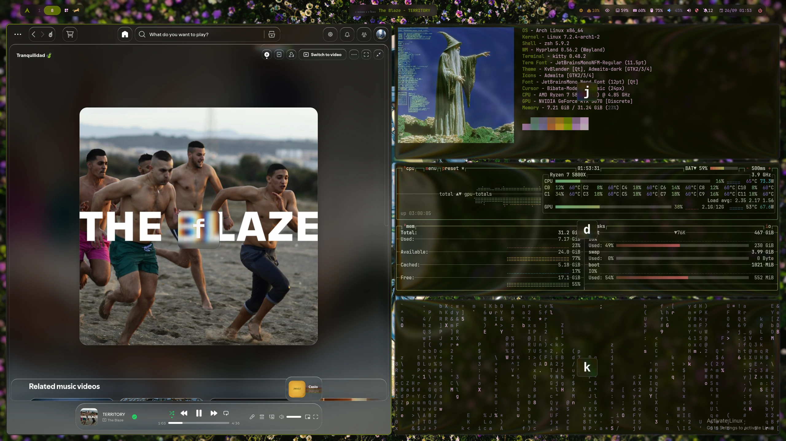

# HyprFlow-Arch

Hyprland + Arch Linux desktop config: multi-monitor, dynamic theming from the
wallpaper, and Waybar modules for peripheral batteries and system status.





## Quick start

```bash
git clone --recursive https://github.com/AlejandroMinor/HyprFlow-Arch.git
cd HyprFlow-Arch
bash install.sh
```

That is the whole install. The script checks your packages, submodules and
Hyprland plugins first, then copies the configs, links the scripts, installs the
fonts and walks you through your monitors. Anything still missing is printed
again at the end with the exact command to fix it, so nothing scrolls past.

If packages are missing it asks before going on: install them now, and if some
still fail, whether to continue without them. Answering no stops the install
before anything is copied (and so does running it without a terminal).

Add `--with-deps --with-plugins` and it installs those without asking.

Then see [First run](#first-run).

### Running it again

It is also the sync tool: name a step and only that step runs. `install.sh config`
is the one you will use most, to push a dotfile change into `~/.config` without
the checks or the monitor wizard. It leaves alone what your machine generated
after the first install: the wallust palette, the monitor layout and the Waybar
bars.

```bash
install.sh                  # everything
install.sh config           # dotfiles, scripts and fonts, then reload
install.sh check            # just tell me what is missing
install.sh theme            # just recolour
install.sh monitors         # just the monitor wizard
install.sh lockscreen       # just rebuild the lockscreen layout
install.sh zsh              # just install .zshrc
install.sh config theme     # steps combine
```

| Option | Effect |
|--------|--------|
| `--with-deps` | Install the missing packages (pacman, then yay or paru) |
| `--with-plugins` | Install the missing Hyprland plugins (compiles, slow) |
| `--with-zsh` | Include the zsh step in a full run |
| `--help` | The list above |

Cloned without `--recursive`? `install.sh` fetches the submodules itself.

## Requirements

Arch, with Hyprland already running. `install.sh` tells you what you are missing,
so you can run it first and let it decide.

Tested is what this setup runs on today. A minimum is given only where something
here needs it, with the reason in Notes; older versions of the rest may work but
are untested.

| Tool | Tested | Minimum | Notes |
|------|--------|---------|-----------------|
| Hyprland | 0.56.2 | 0.55 | the config is Lua (`hl.*`), and scripts dispatch Lua through `hyprctl` |
| hyprlock | 0.9.6 | | |
| Waybar | 0.15.0 | | |
| rofi | 2.0.0 | 2.0 | native Wayland; before 2.0 that was the separate rofi-wayland fork |
| swaync | 0.12.6 | | |
| wallust | 3.5.2 | 3.0 | `wallust cs` for the static themes and the v3 template syntax |
| kitty | 0.48.2 | | |
| PipeWire / WirePlumber | 1.6.8 / 0.5.17 | | `wpctl` drives volume and mute |
| Python | 3.14.7 | 3.10 | `X \| None` type unions in the scripts |
| GTK 4 + gtk4-layer-shell | 4.22 / 1.3.0 | 1.0 | master-pick's overlay |
| headsetcontrol (optional) | 4.0.0 | | USB headset battery and lights |
| python-evdev (optional) | 2.0.0 | | the controller combo for game mode |

Hyprland plugins (hyprglass, hymission) are built by `hyprpm` against the running
Hyprland, so they follow its version.

No kernel has a driver for the Logi Bolt receiver yet (checked on 7.2), so
battery-hub reads it directly; see [Logitech Bolt receiver](docs/optional-setup.md#logitech-bolt-receiver).

<details>
<summary>Full package list</summary>

**What gets installed.** `install.sh --with-deps` installs everything: Hyprland
and its plugins, the bar, launcher and notifications, audio (PipeWire), Bluetooth,
fonts, dark themes for GTK and Qt, and the tools the scripts use. Each package,
grouped and with what it is for: [`packages/pacman.txt`](packages/pacman.txt),
[`packages/aur.txt`](packages/aur.txt). By hand:

```bash
sudo pacman -S --needed hyprland hyprpm hyprlock cpio cmake waybar rofi swaync libnotify awww gnome-themes-extra qt5ct qt6ct ttf-jetbrains-mono-nerd noto-fonts-cjk noto-fonts-emoji gnu-free-fonts imagemagick kitty yazi satty hyprshot hyprpicker wl-clipboard btop fastfetch fzf gnome-disk-utility pipewire pipewire-pulse wireplumber pavucontrol rtkit cava headsetcontrol bluez bluez-utils blueman network-manager-applet openconnect upower power-profiles-daemon brightnessctl playerctl polkit-gnome xdg-desktop-portal xdg-desktop-portal-gtk xdg-desktop-portal-hyprland gtk4 gtk4-layer-shell pacman-contrib python python-gobject python-cairo python-pillow python-evdev jq curl
```

```bash
yay -S --needed wallust waypaper-git wlogout fzf-tab bibata-cursor-theme-bin
```

</details>

Built around a Logitech MX Master 3S and MX Keys Mini (over Bluetooth or a Logi
Bolt receiver) and an Apple Magic Trackpad. The battery module shows them, and any
other device UPower or headsetcontrol reports; everything else works without them.

## Plugins

| Plugin | Repo | Description |
|--------|------|-------------|
| `hymission` | `gfhdhytghd/hymission` | Mission Control-style overview |
| `hyprglass` | `hyprnux/hyprglass` | Liquid glass on transparent windows |

`install.sh` reports which of these are missing or disabled. It does not install
them unless you pass `--with-plugins`, because `hyprpm` compiles each one against
your running Hyprland, which is slow and can fail. By hand:

```bash
hyprpm update
hyprpm add https://github.com/gfhdhytghd/hymission
hyprpm enable hymission
```

Add a plugin to `PLUGIN_NAMES` and `PLUGIN_REPOS` at the top of `install.sh` and the
check picks it up.

## Services

`install.sh` does not enable system services. Bluetooth needs its daemon running:

```bash
sudo systemctl enable --now bluetooth
```

Pairing prompts come from `blueman-applet`, which Hyprland starts at login. Without it BlueZ has nobody to ask and cancels the request, so a device like a DualShock connects for a few seconds and drops.

## First run

- **Keybindings:** `Super + I` lists them all.
- **Monitors:** the installer already ran the wizard. Run `monitors.sh setup` again
  whenever you add a screen or want another order, rotation or refresh rate; see
  [Monitors](docs/monitors.md).
- **Colours:** pick a wallpaper in `waypaper` and the whole desktop recolours from
  it, or run `theme-picker.sh` for a preset; see [Theming](docs/theming.md).

## Per machine extras

For things only one machine needs (mounting a games drive, an app to autostart, a device specific setting), create `~/.config/hypr/local.lua`. `hyprland.lua` loads it when it exists and it is not part of the repo, so `install.sh config` never overwrites it:

```lua
hl.on("hyprland.start", function ()
    hl.exec_cmd("udisksctl mount -b /dev/disk/by-label/Games")
end)
```

## If something goes wrong

- **Animation or invalid-reference errors on startup.** The plugins are stale
  relative to your Hyprland version. Run `hyprpm update`.
- **Bar on the wrong monitor.** Run `monitors.sh list` to see identifiers, then
  `monitors.sh setup` to rebuild.
- **Script won't run.** `chmod +x <script>`. `install.sh` does this automatically.
- **Swapped a monitor on the same port and it kept the old one's rotation.** Hyprland only notices a new screen after a real disconnect: unplug, wait about five seconds, plug the new one in. Profiles belong to the set of connected monitors (by make, model and serial), so the new set gets the default layout until you run `monitors.sh setup` for it.
- **Screens flicker to default modes for a moment when leaving solo or game mode.** A switched off DisplayPort monitor sleeps and wakes every few seconds, reporting itself disconnected meanwhile; if it drops right as the layout is restored, Hyprland falls back for a few seconds and then settles. Turning off the monitor's deep sleep (often called Deep Sleep or DP Auto Sleep in its menu) avoids it.

## Documentation

Once it runs, for changing things or looking them up:

| I want to… | Read |
|------------|------|
| Arrange monitors, rotate, mirror, keep one screen on | [Monitors](docs/monitors.md) |
| Play on the TV with a controller | [Game mode](docs/game-mode.md) |
| Change what is in the bar and how it looks | [Waybar](docs/waybar.md) |
| Change colours, wallpaper, presets, the launcher, dark apps | [Theming](docs/theming.md) |
| Change the lockscreen layout and avatar | [Lockscreen](docs/lockscreen.md) |
| Set up zsh, RGB lighting, battery alerts, a Bolt receiver, a trackpad | [Optional setup](docs/optional-setup.md) |
| Know what a given script does | [Scripts](docs/scripts.md) |
| Understand how it is built, add a module, run the tests | [Development](docs/development.md) |

## Older versions

The Hyprland config here is Lua, the format since Hyprland 0.55 (`.conf`/hyprlang
is deprecated). The last `.conf` version is tagged `pre-lua-migration`.
