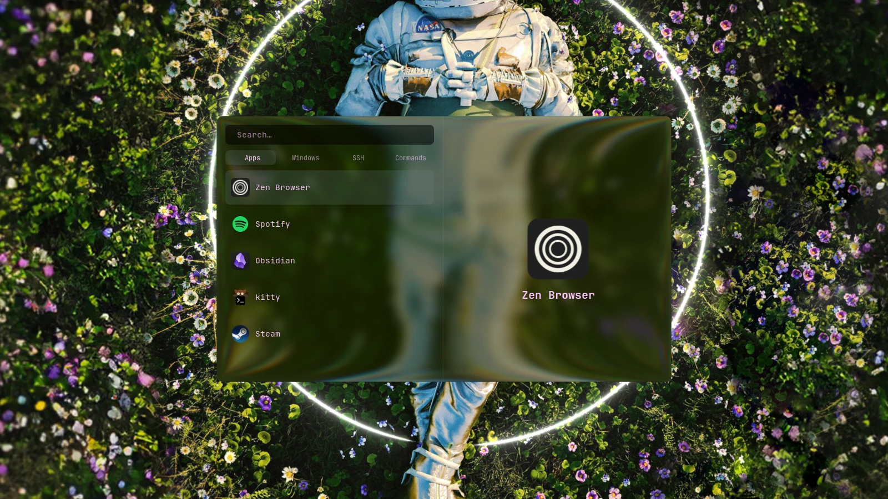

# Theming

Colors come from `wallust`, regenerated on wallpaper change and pushed to Waybar,
Hyprland, kitty, rofi, wlogout, hyprlock, and cava.

Wire it up in `~/.config/waypaper/config.ini`:

```ini
[Settings]
backend = awww
fill = fill
zen_mode = True
post_command = bash -c "$HOME/.local/bin/wallust-theme-manager.sh --generate-palette --notify"
```

Run `theme-picker.sh` to pick between the wallpaper palette and eighteen presets:

- **Classic** — pure black background and a high-contrast ANSI palette. This is the
  default, restored by `wallust-theme-manager.sh --restore-default`.
- **Nocturne** — dark grey background, desaturated everything, for night work.
- **Accent Blue / Red / Yellow / Green / Purple** — a shared neutral grey base where
  a single saturated hue carries the window border, the cursor and the selected
  states, so the terminal stays readable under any wallpaper.
- **Solarized Dark** — the Schoonover palette, tuned for uniform luminance so no
  single color jumps out. Low contrast by design.
- **Phosphor Amber** — a single amber hue stepped by luminance, VT220 style.
- **High Contrast** — every text color clears WCAG AAA (7:1) against pure black,
  for working outdoors or in direct sunlight.
- Tokyo Night, Catppuccin, Nord, Gruvbox, Dracula, Monochrome, Synthwave, Kanagawa.

The list is read from `~/.config/wallust/themes/`: drop another wallust theme JSON
there and it shows up in the picker. Without the picker,
`wallust-theme-manager.sh --theme nord` applies one directly.

Cava runs both in the terminal and as the `custom/cava` Waybar module, which dims
to a faint baseline when there's no audio. Its palette follows wallust too, and so
do the fzf pickers (`theme-picker.sh`, `pet-picker.sh`).

## Launcher

`dotconfig/rofi/hyprflow/`: real transparency, wallust colors.
`launcher-centered.rasi` is the launcher, reached by `Super + Space`, the
four-finger pinch gesture and the Waybar launcher icon; it builds on
`launcher-base.rasi`. Power menu is `wlogout`, also themed.



## Dark apps

Each toolkit takes its theme from a different place, and all of
them are set up dark:

| Apps | Set by |
|------|--------|
| GTK 4, libadwaita, GTK 3 | the theme step, through `gsettings` (`prefer-dark`, `Adwaita-dark`) |
| Qt 5 and 6 | `qt5ct`/`qt6ct`: Fusion with a dark palette, plus `qss/hyprflow.qss` for rounded buttons and inputs |
| GPG's passphrase prompt | `pinentry/preexec`: the Qt prompt instead of the GTK 2 one, which has no dark theme |
